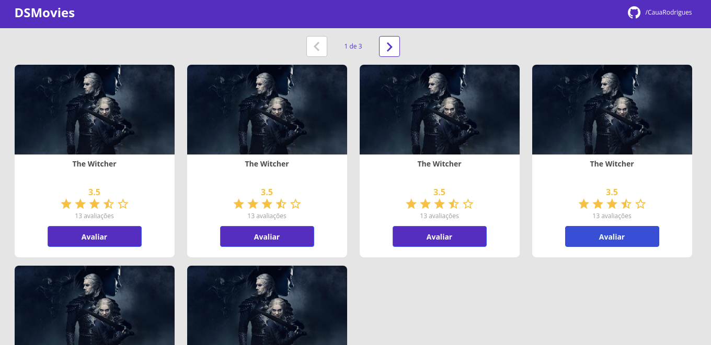

# Projeto DSMovies
O projeto consiste em uma aplicação web que permite a avalição de diversos filmes e a sua listagem de forma paginada. Foi utilizado ReactJs no Frontend e para o Backend Java com o framework Spring Boot. Foram 3 aulas com a duração média de 2 horas cada aula sob a instrução do professor [Nelio Alves](https://github.com/acenelio) da [DevSuperior](https://github.com/devsuperior).

---

Link: https://dsmovies-akamatu.netlify.app/

 
<h1 align="center">🚧 Projeto em Andamento 🚧</h1>